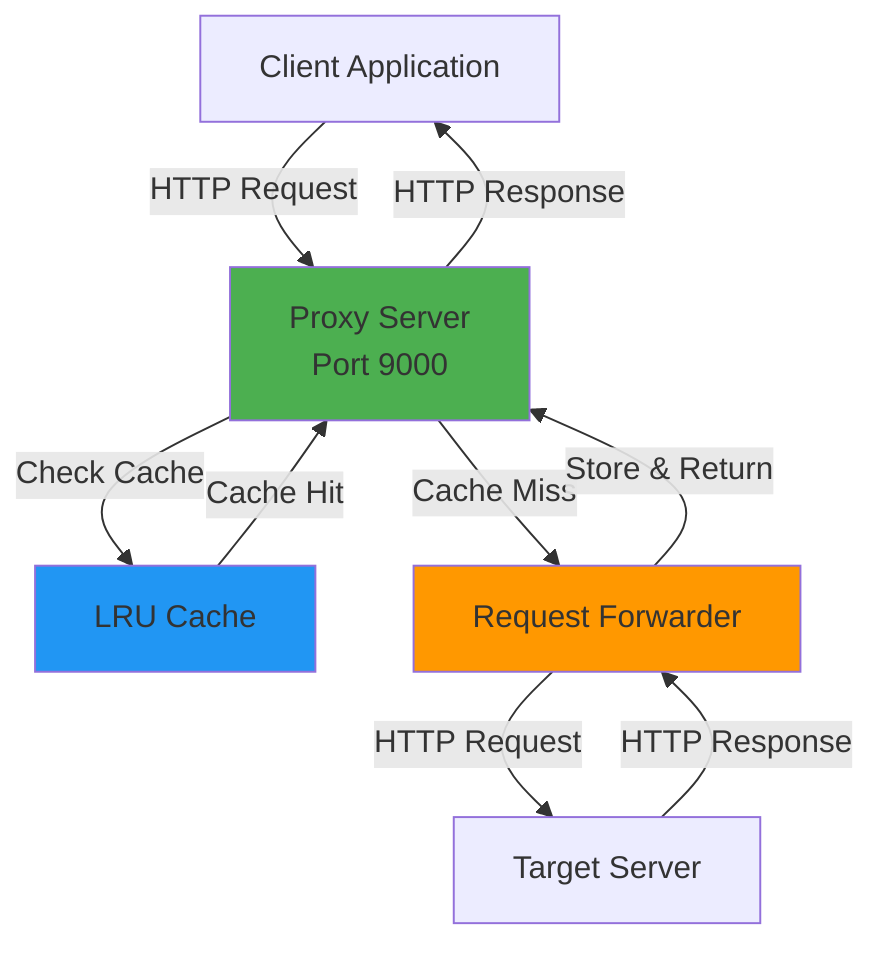
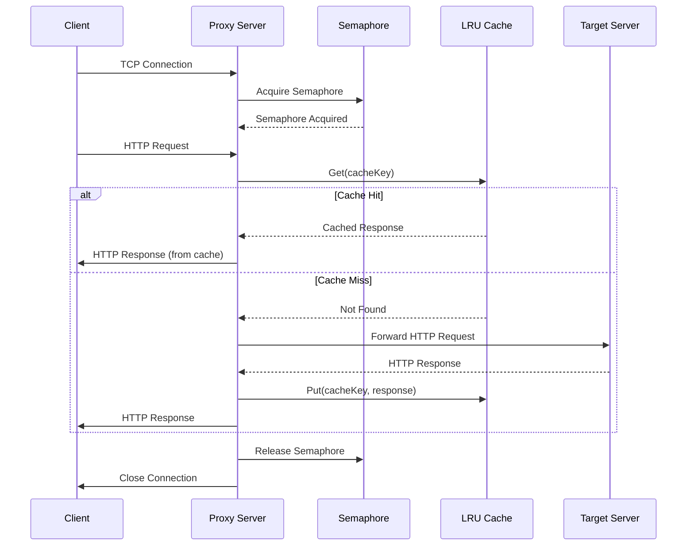
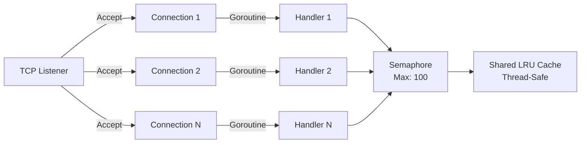
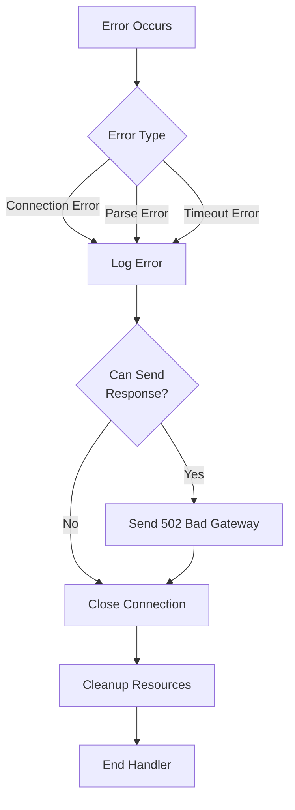

# 🏗️ Architecture Documentation

## System Architecture

### High-Level Overview

The Multi-Threaded Proxy Server is designed as a forward HTTP proxy that sits between clients and target servers, providing caching and concurrent request handling capabilities.



## Component Architecture

### 1. Main Server Component

```mermaid
classDiagram
    class ProxyServer {
        -infoLogger *log.Logger
        -errorLogger *log.Logger
        -cache *LRUCache
        -config *Config
        -semaphore chan struct{}
        +Start() error
        +handleConnection(conn net.Conn)
        +forwardRequest(req *http.Request) *http.Response
        +prepareResponse(resp *http.Response) string, string, []byte
    }
    
    class Config {
        +Port string
        +MaxClients int
        +CacheSize int
    }
    
    class LRUCache {
        -mu sync.Mutex
        -capacity int
        -size int
        -head *node
        -tail *node
        -items map[string]*node
        +Get(key string) bool, *ProxyItem
        +Put(key string, value *ProxyItem)
        +Size() int
        +Capacity() int
    }
    
    ProxyServer --> Config
    ProxyServer --> LRUCache
```

### 2. Request Flow



### 3. Concurrency Model



### 4. Cache Data Structure

```mermaid
graph LR
    subgraph "LRU Cache Structure"
        Map[HashMap<br/>O(1) Lookup] --> Node1[Node 1<br/>Key: host:path:method<br/>Value: ProxyItem]
        Map --> Node2[Node 2]
        Map --> NodeN[Node N]
        
        Node1 <-->|prev| Node2
        Node2 <-->|next| Node1
        Node2 <-->|prev| NodeN
        NodeN <-->|next| Node2
        
        Head[Head<br/>Most Recent] --> Node1
        Tail[Tail<br/>Least Recent] --> NodeN
    end
    
    style Head fill:#4CAF50
    style Tail fill:#F44336
```

## Data Flow

### Request Processing Pipeline

```
1. TCP Connection Accepted
   ↓
2. Semaphore Acquired (if available)
   ↓
3. HTTP Request Parsed
   ↓
4. Cache Key Generated: "host:path:method"
   ↓
5. Cache Lookup
   ├─→ Cache Hit: Return cached response
   └─→ Cache Miss: Continue to step 6
   ↓
6. Forward Request to Target Server
   ├─→ Establish TCP connection
   ├─→ Build HTTP request string
   ├─→ Send request
   └─→ Read response
   ↓
7. Parse Response
   ├─→ Extract status line
   ├─→ Extract headers
   └─→ Extract body
   ↓
8. Store in Cache (if cacheable)
   ↓
9. Send Response to Client
   ↓
10. Release Semaphore & Close Connections
```

## Thread Safety

### Mutex Protection

All cache operations are protected by a `sync.Mutex`:

```go
func (c *LRUCache) Get(key string) (bool, *ProxyItem) {
    c.mu.Lock()         // Acquire lock
    defer c.mu.Unlock() // Release lock on return
    
    // ... cache operations
}
```

### Semaphore-Based Concurrency Control

```go
// Semaphore limits concurrent connections
semaphore := make(chan struct{}, maxClients)

// In handler:
semaphore <- struct{}{}  // Acquire
defer func() {
    <-semaphore  // Release
}()
```

## Error Handling Strategy



## Performance Optimizations

1. **Connection Pooling**: Reuse TCP connections where possible
2. **LRU Caching**: Fast O(1) cache operations
3. **Goroutine Pooling**: Efficient concurrent request handling
4. **Zero-Copy Where Possible**: Minimize memory allocations
5. **Timeout Management**: Prevent resource leaks

## Scalability Considerations

- **Horizontal Scaling**: Can run multiple instances behind a load balancer
- **Vertical Scaling**: Limited by Go's goroutine efficiency (can handle thousands)
- **Cache Scaling**: In-memory cache limits to single instance; distributed cache would require external solution
- **Connection Limits**: Configurable via `-max-clients` flag

## Security Architecture

```
┌─────────────────────────────────────┐
│         Security Layers             │
├─────────────────────────────────────┤
│ 1. Connection Timeouts              │
│ 2. Input Validation                 │
│ 3. Resource Limits (Semaphore)      │
│ 4. Panic Recovery                   │
│ 5. Error Sanitization               │
└─────────────────────────────────────┘
```

## Monitoring Points

1. **Connection Count**: Track active connections
2. **Cache Hit Rate**: Monitor cache effectiveness
3. **Request Latency**: Measure response times
4. **Error Rate**: Track failed requests
5. **Memory Usage**: Monitor cache size and growth

---

*This architecture is designed for high performance, reliability, and maintainability.*

